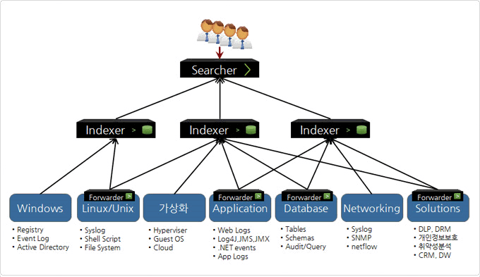
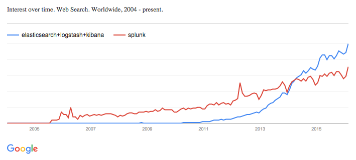

# splunk

홈 페이지 : [http://splunk.mdstec.com](http://splunk.mdstec.com/), [https://www.splunk.com](https://www.splunk.com/)

빅데이터 / 머신러닝 솔루션  
로그 데이터, 실시간 이벤트 데이터, 장비 데이터를 수집하고 모니터링, 분석을 통해 원하는 대시보드 생성 및 보고

  
> elk 랑 유사항 솔루션이라 생각됨.

### 제공 기능

[https://www.splunk.com/ko_kr/products/splunk-enterprise/free-vs-enterprise.html](https://www.splunk.com/ko_kr/products/splunk-enterprise/free-vs-enterprise.html)

### 데이터 인덱싱

로그, 클릭스트림 데이터, 구성, 센서 데이터, 트랩 및 경고, 변경 이벤트, 진단 명령 결과, API 및 메시지 대기열의 데이터, 사용자 지정 애플리케이션의 멀티라인 로그에 이르기까지 형식이나 위치에 관계없이 모든 머신 데이터(machine data)를 인덱싱  
사전 정의된 스키마 없이 모든 소스, 형식 및 위치에서 데이터를 인덱싱  
인덱싱 결과를 문제 해결, 보안 사고 조사, 네트워크 모니터링, 컴플라이언스 보고, 비즈니스 분석 등의 용도로 사용

### 한글 메뉴얼

[https://docs.splunk.com/images/f/f3/Splunk-6.5.0-ko_KR-Admin.pdf](https://docs.splunk.com/images/f/f3/Splunk-6.5.0-ko_KR-Admin.pdf)  
[https://www.facebook.com/groups/SplunkKoreaUserGroup/](https://www.facebook.com/groups/SplunkKoreaUserGroup/)

### 커뮤니티

[http://cafe.naver.com/splunker](http://cafe.naver.com/splunker)  
[스플렁크한국어사용자위키](http://splunk.finfra.com/d/doku.php/start)

### 가격정책

[https://www.splunk.com/en_us/products/pricing.html](https://www.splunk.com/en_us/products/pricing.html)
> 한국 총판 문의  
> - 영구 라이선스
>   - 1G - 구축비: 2천 3백 만원. 유지비: 별도
>   - 100G - 구축비: 2억 8~9천. 유지비: 별도
>
> 쿠팡 10G 이용 중, 넥슨 테라급 으로 이용 중

### elk 와 splunk

[http://blog.embian.com/18](http://blog.embian.com/18)  
>Splunk와 ELK Stack은 End-to-End Solution이라는 면에서는 비슷할지 모르나, Splunk보다 기능적으로 부족하다.  
현재는 ELK Stack이 Splunk비해 사용하기 불편하지만, 경제적인 측면까지 고려한다면 ELK Stack이 Splunk의 대체 Solution으로 유용할것이라 생각한다.

[http://blog.takipi.com/splunk-vs-elk-the-log-management-tools-decision-making-guide/](http://blog.takipi.com/splunk-vs-elk-the-log-management-tools-decision-making-guide/)  
> 트랜드

splunk 비싸다, elk 무료 오픈소스이지만 시간이 많이 걸리고 하드웨어 비용을 감당해야 한다.  
splunk 사용하기 쉽고 직관적, 매우 편한 인터페이스, 많은 검색 기능, elk splunk에 비해 손이 많이 가고 검색 기능이 약하다.  
splunk 사용자 관리 기능및 액세스 권한을 핸들링 할 수 있다, elk 사용자 관리 기능 부재.

### 장비 구축 및 확장

머신장비 우리가 구축  
구축된 장비에 splunk 세팅, 스케일 아웃 등 자유로이 진행  
파트너 사를 통해 데이터 백업, 리플리케이션 등 모든 서비스 지원

### MDS 테크놀로지 문의

클라이언트 덤프 파일 등을 올리거나 내려 받는 file serve 기능은 지원하지 않음  
게임 클라이언트 등에서 직접 splunk로 데이터 등을 보내지 않음 (하려면 에이전트 필요)
사용자 권한 설정 및 그룹핑 기능 지원
파트너 사를 통해 시스템 구축 및 가이드 지원

### ers 에 splunk 적용

* 게임별, 사용자별 권한 관리 가능 (웹 뷰 지원)
* 클라이언트 단에서 바로 크래시 로그 취합 불가능
  * was 통해서 splunk로 전달 하도록 구축
* 덤프파일 내려받기 등은 따로 구축 해서 ftp 등으로 지원 해야 함 (기본 웹 뷰 단에서 불가능)